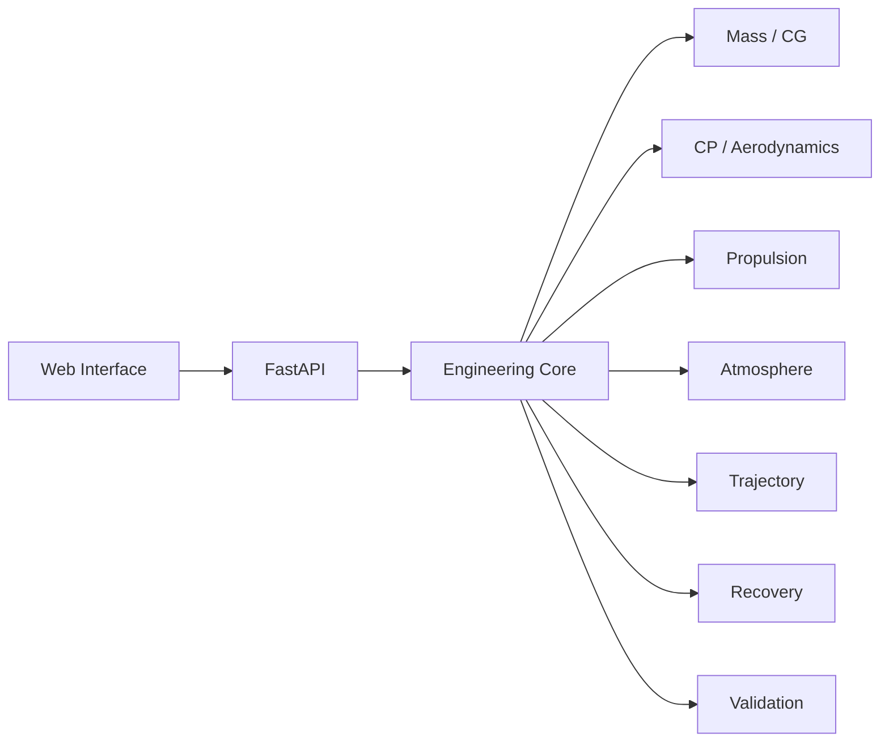

# TRAJECTUM

<p align="center">
  
</p>

<p align="center">
  <strong>Aerospace engineering and flight-simulation software for vehicle definition, stability analysis, trajectory modelling and technical review.</strong>
</p>

<p align="center">
  <a href="https://github.com/martinveron2/TRAJECTUM/actions/workflows/ci.yml"></a>
  
  
  
  <a href="https://trajectum-vercel.vercel.app"></a>
  
</p>

<p align="center">
  <a href="https://trajectum-vercel.vercel.app"><strong>Live Demo</strong></a>
  ·
  <a href="docs/USER_GUIDE.md">User Guide</a>
  ·
  <a href="docs/VALIDATION.md">Validation</a>
  ·
  <a href="docs/ENGINEERING_EVIDENCE.md">Engineering Evidence</a>
</p>

---

## What TRAJECTUM does

TRAJECTUM is a modular aerospace engineering platform with a Python physics core and a TypeScript/React web interface. The current CDR workflow brings vehicle geometry, mass properties, propulsion, stability, trajectory, recovery and engineering reporting into one traceable analysis environment.

The project keeps model assumptions and evidence levels explicit. A passing software test is not treated as physical validation, and cross-tool agreement is not presented as experimental validation.

## Quick Start

The repository includes a Windows launcher that verifies Git, Python and npm, updates the local checkout, prepares dependencies, starts the API and web interface, and runs the current UTN CDR reference case.

```bat
git clone https://github.com/martinveron2/TRAJECTUM.git
cd TRAJECTUM
ACTUALIZAR_E_INICIAR.bat
```

When startup succeeds, the script reports the local web and API addresses and executes the reference case through the existing physics CLI.

For the deployed interface, use the [Live Demo](https://trajectum-vercel.vercel.app).

## Capabilities

| Capability | Current approach |
| --- | --- |
| Mass properties / CG | Component mass moments and axial stations |
| CP / stability | Barrowman-style first-order CP model and static margin |
| Propulsion | Time-varying thrust curve and propellant depletion |
| Atmosphere | Standard-atmosphere implementation |
| Trajectory | 2D point-mass equations integrated with RK4 |
| Recovery | Simplified drag-based descent model |
| Validation | Analytical checks, regression tests and independent cross-tool comparison |
| Reporting | Engineering results, exports and design-review documentation |

## Architecture



The deployed application is assembled from the repository's existing `frontend/web`, `backend/*`, `main.py` and reference-case data. Runtime paths are intentionally left unchanged during documentation-only cleanup.

## Validation & Engineering Evidence

TRAJECTUM separates software verification, model verification, cross-tool verification and experimental validation.

The current validation documentation includes an independent trajectory comparison against RocketPy under matched first-order assumptions. That comparison is used as a numerical cross-check, not as certification and not as a substitute for test or flight data.

- [Validation](docs/VALIDATION.md)
- [Engineering Evidence](docs/ENGINEERING_EVIDENCE.md)
- [CDR status](docs/CDR_STATUS.md)
- [Repository presentation audit](docs/REPOSITORY_AUDIT.md)
- [ADR-001: RK4 integration](docs/adr/ADR-001-rk4-integration.md)

## Repository Layout

```text
TRAJECTUM/
├── .github/           # CI workflows
├── backend/           # API, core, physics, CAD, reporting and validation
├── cad/               # CAD reference material
├── data/              # vehicle definitions and reference cases
├── docs/              # engineering and project documentation
├── examples/          # reproducible examples
├── frontend/web/      # TypeScript / React / Vite application
├── infra/             # development and deployment infrastructure
├── scripts/           # local / cloud operational scripts
├── main.py            # deployed FastAPI/static application entrypoint
└── vercel.json        # Vercel build and function configuration
```

## Status

- **CDR documentation baseline:** `v0.1.0-cdr`
- **Web package version:** `0.1.0-dev0`
- **Development state:** active engineering development
- **Release history:** [CHANGELOG.md](CHANGELOG.md)
- **Release notes:** [v0.1.0-cdr](docs/RELEASE_NOTES_v0.1.0-cdr.md)
- **Evidence matrix:** [Engineering Evidence](docs/ENGINEERING_EVIDENCE.md)

The differing CDR documentation and web-package version identifiers are preserved explicitly rather than silently normalized.

## Documentation

- [User Guide](docs/USER_GUIDE.md)
- [Validation](docs/VALIDATION.md)
- [Engineering Evidence](docs/ENGINEERING_EVIDENCE.md)
- [Fin Input Contract](docs/FIN_INPUT_CONTRACT.md)
- [Repository Map](docs/architecture/REPOSITORY_MAP.md)
- [Traceability](docs/architecture/TRACEABILITY.md)
- [Mobile UI Navigation](docs/architecture/MOBILE_UI_NAVIGATION.md)
- [Roadmap](docs/roadmap/V0.1_CDR_ROADMAP.md)
- [Licensing](LICENSING.md)

## Current limitations

Depending on the active case and module, the current release includes first-order aerodynamic models, a 2D point-mass trajectory workflow rather than full 6-DOF dynamics, provisional aerodynamic inputs in some reference cases, and simplified recovery modelling.

These limits are documented deliberately. Results should remain tied to their configuration revision and evidence state.

## Roadmap

The existing roadmap is maintained in [docs/roadmap/V0.1_CDR_ROADMAP.md](docs/roadmap/V0.1_CDR_ROADMAP.md). Future work includes stronger CAD-to-analysis interoperability, additional reference cases, expanded aerodynamic analysis, improved visualization and physical-test evidence where available.

## Licensing

TRAJECTUM is source-available under the **PolyForm Noncommercial License 1.0.0**.

Permitted noncommercial use, modification and distribution are governed by [LICENSE](LICENSE). Commercial use requires separate written permission. Third-party material remains subject to its own licenses and notices.

See [LICENSING.md](LICENSING.md) and [NOTICE](NOTICE).

## Citation

A `CITATION.cff` file has not been added yet because the repository currently exposes both the CDR documentation identifier `v0.1.0-cdr` and the web package version `0.1.0-dev0`.

**[DECISIÓN PENDIENTE: confirmar la versión pública que debe utilizarse para la cita antes de crear CITATION.cff.]**
