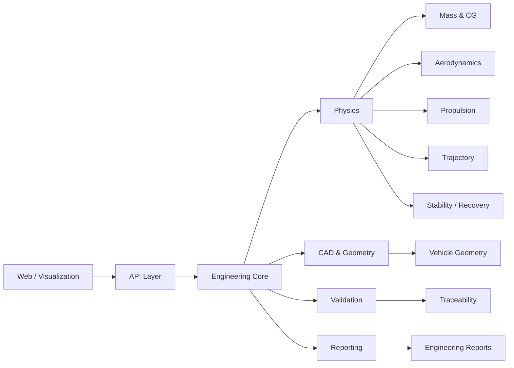

# TRAJECTUM

<p align="center">
  
</p>

<p align="center">
  <strong>Model · Simulate · Validate · Fly</strong><br>
  Mobile engineering workflow ready · Desktop interface in development
</p>

<p align="center">
  <strong>Aerospace Engineering & Flight Simulation Platform</strong><br>
  Open engineering software for rocket vehicle definition, stability analysis, trajectory simulation, recovery modelling and technical validation.
</p>

<p align="center">
  
  
  
  
  
</p>

<p align="center">
  <strong>Academic reference case:</strong> UTN FR Haedo · Mecánica de los Fluidos · Grupo 07 · CDR 2026
</p>

<p align="center">
  <a href="https://trajectum-vercel.vercel.app"><strong>Live Demo</strong></a>
  · <strong>Mobile app: ready</strong>
  · <strong>Desktop interface: in development</strong>
  ·
  <a href="docs/USER_GUIDE.md">User Guide</a>
  ·
  <a href="docs/VALIDATION.md">Validation</a>
  ·
  <a href="https://github.com/martinveron2/TRAJECTUM/issues/52"><strong>Engineering Review</strong></a>
</p>

---

## Engineering Purpose

TRAJECTUM is an aerospace engineering and flight-simulation platform developed to bring vehicle geometry, mass properties, propulsion, stability, trajectory, recovery, validation and technical reporting into a common analysis workflow.

The repository is organized as a modular monorepo so that geometry, physics, CAD, APIs, validation, reporting and user interfaces can evolve independently while sharing a common engineering model.

The current academic reference case is based on the **Grupo 07** configuration used in the **Mecánica de los Fluidos** integrative project at **Universidad Tecnológica Nacional — Facultad Regional Haedo (UTN FRH)**, including PDR and CDR design-review stages.

TRAJECTUM is an independently developed software project. It is **not an official UTN institutional product, endorsement, certification or publication**.

## Engineering Scope

- **Mass properties** — mass, center of gravity and configuration state.
- **Flight physics** — atmosphere, propulsion, stability, recovery and trajectory foundations.
- **Aerodynamics** — interfaces for low- and higher-fidelity aerodynamic analysis.
- **CAD & geometry** — vehicle geometry and engineering model integration.
- **Validation** — traceable engineering checks, reference cases and verification workflows.
- **Reporting** — reproducible technical outputs for design reviews.
- **Platform interfaces** — API and web layers for future interactive engineering workflows.

## Architecture



## Technology Stack

| Layer | Technology |
| --- | --- |
| Engineering core | Python 3.11+ |
| API | FastAPI + Pydantic |
| Web interface | TypeScript + React + Vite |
| Containers | Docker / Docker Compose |
| Quality | Pytest, Ruff, MyPy |
| CI | GitHub Actions |
| Documentation | Markdown + Mermaid |

## Repository Layout

```text
TRAJECTUM/
├── backend/
│   ├── api/          # API contracts and services
│   ├── cad/          # CAD and geometry domain
│   ├── core/         # shared engineering core
│   ├── physics/      # flight physics engine
│   ├── reporting/    # technical reporting
│   └── validation/   # verification and validation
├── frontend/web/     # TypeScript / React interface
├── data/             # engineering datasets and vehicle definitions
├── docs/             # architecture, roadmap and validation docs
├── examples/         # reproducible engineering examples
└── infra/            # development / deployment infrastructure
```

## Documentation

- **[User Guide](docs/USER_GUIDE.md)** — operating workflow, engineering inputs, analysis, result interpretation and current model limitations.
- **[Fin Input Contract](docs/FIN_INPUT_CONTRACT.md)** — fin geometry and airfoil input conventions.
- **[Validation](docs/VALIDATION.md)** — independent cross-checks, validation scope and reproducibility notes.
- **[Engineering Evidence](docs/ENGINEERING_EVIDENCE.md)** — capability-by-capability evidence, status and limitations.
- **[Changelog](CHANGELOG.md)** — milestone history and release evolution.
- **[v0.1.0-cdr Release Notes](docs/RELEASE_NOTES_v0.1.0-cdr.md)** — scope, validation status and known limits.
- **[Licensing](LICENSING.md)** — public and commercial licensing scope.
- **[Contributing](CONTRIBUTING.md)** — engineering contribution and validation standards.
- **[Launch Kit](docs/LAUNCH_KIT.md)** — concise technical copy for sharing the project responsibly.

## Development Roadmap

- [x] Consolidated modular monorepo
- [x] Initial API, CAD, core, physics, reporting and validation domains
- [x] Web application foundation
- [x] CI and container infrastructure
- [x] Source-available licensing model
- [ ] Expand flight-physics models and reference cases
- [ ] Strengthen CAD / vehicle geometry workflows
- [ ] Add aerodynamic analysis integrations
- [ ] Expand trajectory and stability visualization
- [ ] Publish reproducible validation cases
- [x] Release an interactive technical demonstration

## Validation

TRAJECTUM uses explicit reference cases and independent cross-checks to verify numerical behavior. The current CDR trajectory has been compared against **RocketPy 1.13.0** under matched first-order assumptions, with close agreement in apogee, burnout state, maximum velocity, Mach number and dynamic pressure.

This comparison is treated as an **independent cross-check**, not as experimental validation. See **[Validation](docs/VALIDATION.md)** for assumptions, numerical results and scope.

## Engineering Evidence

TRAJECTUM separates **software maturity** from **physical-model maturity**. Each major capability is tied to an explicit method, evidence source, status and limitation so that a passing build is never mistaken for experimental validation.

See **[Engineering Evidence](docs/ENGINEERING_EVIDENCE.md)** for the current verification matrix.

## Engineering Review

Technical review is welcome from engineers, researchers and developers working in aerodynamics, CFD, flight dynamics, GNC, rocketry, scientific computing and aerospace software.

Current review topics include trajectory integration, aerodynamic modelling, CG/CP and static stability, propulsion-curve treatment, variable mass, atmosphere and drag modelling, validation strategy and software reproducibility.

Use **[Engineering Review #52](https://github.com/martinveron2/TRAJECTUM/issues/52)** for focused technical feedback. GitHub Discussions are also enabled for broader technical conversation. If you genuinely find the project useful or promising, a GitHub star is appreciated, but concrete engineering criticism is the priority.

## Engineering Principles

TRAJECTUM aims for **traceability, reproducibility and physical transparency**. Numerical outputs should be tied to explicit assumptions, models, units and validation evidence. Higher-fidelity capabilities should be added without hiding the engineering reasoning behind black-box interfaces.

## Project Status

- **Current engineering focus:** `v0.1.0-cdr`
- **Development state:** active engineering development
- **CI:** [GitHub Actions](https://github.com/martinveron2/TRAJECTUM/actions/workflows/ci.yml)
- **Release history:** [CHANGELOG.md](CHANGELOG.md)
- **Release notes:** [v0.1.0-cdr](docs/RELEASE_NOTES_v0.1.0-cdr.md)

CI status is intentionally presented here rather than in the project header so that build health remains visible without dominating the technical overview.

## Language Statistics

GitHub's language bar reflects source-code volume, not developer proficiency. This repository uses GitHub Linguist attributes to keep generated files, vendored dependencies and documentation from distorting the code-language statistics.

The active application stack is centered on **Python** for engineering computation and **TypeScript** for the web platform.

## Licensing

TRAJECTUM is source-available under the **PolyForm Noncommercial License 1.0.0**.

Use, modification and distribution for permitted noncommercial purposes are governed by the public license. Commercial use requires a separate written commercial license from the copyright holder. Third-party components remain subject to their own licenses and notices.

See [LICENSE](LICENSE), [LICENSING.md](LICENSING.md) and [NOTICE](NOTICE).

---

<p align="center">
  <strong>TRAJECTUM</strong><br>
  Aerospace Engineering · Flight Physics · Simulation · Validation
</p>
